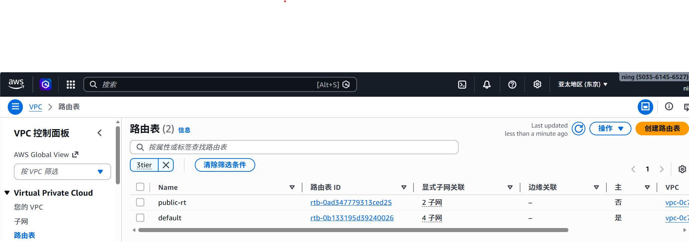
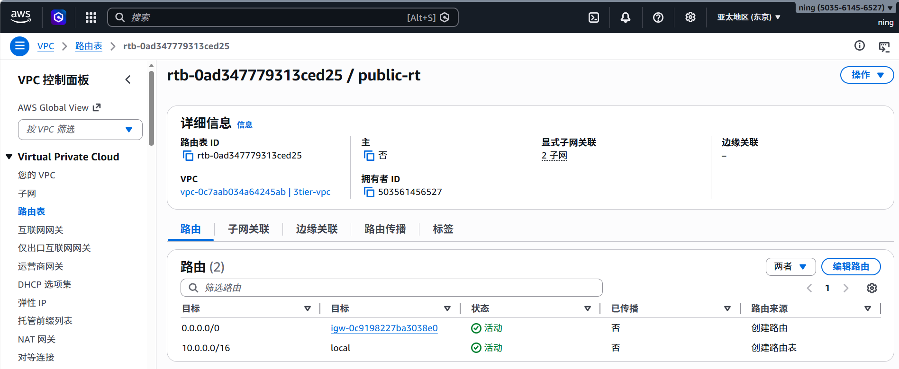

# aws-vpc-practice
三层架构（Web层 + App层 + 数据层）

步骤规划

第 1 步：创建 VPC 和子网

创建 VPC（10.0.0.0/16）

子网名称	可用区	CIDR	类型	用途
web-az1	us-east-1a	10.0.1.0/24	公有	Web层（ALB）
web-az2	us-east-1b	10.0.2.0/24	公有	Web层（ALB）
app-az1	us-east-1a	10.0.11.0/24	私有	应用层 EC2
app-az2	us-east-1b	10.0.12.0/24	私有	应用层 EC2
db-az1	us-east-1a	10.0.21.0/24	私有	数据库层 RDS
db-az2	us-east-1b	10.0.22.0/24	私有	数据库层 RDS

第 2 步：创建网关和路由表

创建 Internet Gateway，关联公有子网
创建 NAT Gateway，关联私有子网
配置路由表

第 3 步：创建安全组

Web 安全组：允许 80、443 来自 0.0.0.0/0
App 安全组：只允许来自 Web 安全组的流量
DB 安全组：只允许来自 App 安全组的 3306 端口

第 4 步：启动 EC2 实例

Web 层：t2.micro，公有子网，安装 nginx
App 层：t2.micro，私有子网，测试连通性

第 5 步：创建 RDS 数据库

MySQL，db.t2.micro，私有子网
验证 App 层能连接，Web 层不能直接连接

第 6 步：验证架构

从互联网访问 Web 层（能打开 nginx 页面）
确认 App 层能访问外网（通过 NAT 更新软件）
确认数据库只能被 App 层访问

